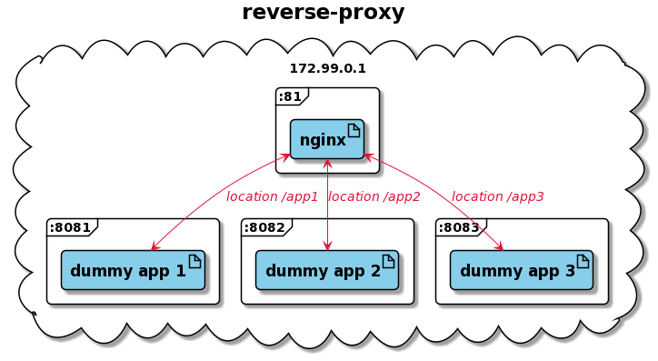
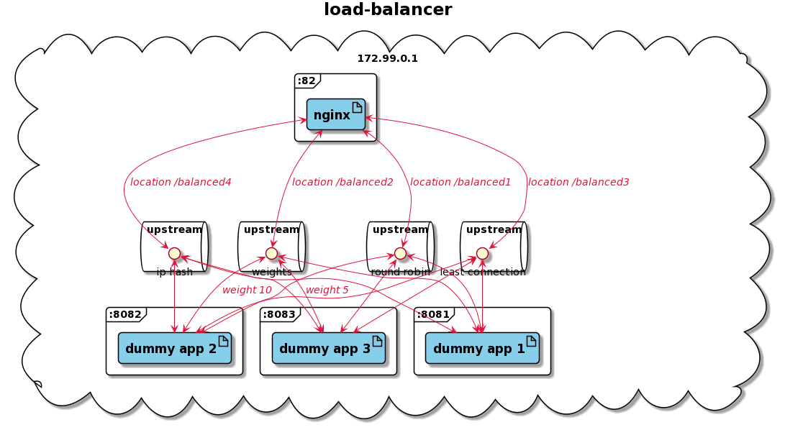
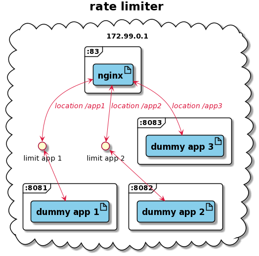

# nginx playground

## containers
* only nginx alpine images in use

### reverse-proxy
* this is a minimal nginx config with which you can simply start a nginx server and route to other apps in your environment
* I set up a custom log format
* all you need are following parts `listen <<PORT>>`, `server_name <<HOST>>` and locations -> `/` for all locations or specify e.g. via `/app1`

### load-balancer
* this is the same minimal nginx config from the reverse-proxy above
* it also has anonymized logging (last part of the IP address is always ZERO)
* additionally it has some proxy headers set up
* there are 4 ways for load-balancing: round-robin, weights, least-connection, ip-hash

### rate-limiter
* again the same minimal nginx config from the reverse-proxy above
* it also has anonymized logging (last part of the IP address is always ZERO)
* rate limits on app1 and app2 with different "zones"
* nginx stores 10MB of binary ip adresses (accoording to nginx these are 160.000)

### dummy-services
* this are three dummy services - also based on nginx
* they are also good to start standalone -> so you have three apps to test some other load-balancers or something else in front of them

## execution

### start
1. Create network: `docker network create --subnet=172.99.0.0/16 --gateway 172.99.0.1 nginx-playground-network`
   1. (we need this to avoid a restart of the reverse-proxy oder load-balancer after a breakdown of an upstream)
1. Start the three dummy services -> go to dummy-services folder and execute `docker-compose up -d`
1. Then you have 3 choices -> start only load-balancer, only reverse-proxy or both
1. Go to the according folder and start the containers with `docker-compose up -d`

### stop
1. Go to all subfolders (where you did a compose up) and execute `docker-compose down`

### browser
* reverse-proxy is available on [http://localhost:81](http://localhost:81)
* load-balancer is available on [http://localhost:82](http://localhost:82)
* rate-limiter is available on [http://localhost:83](http://localhost:83)

## other helpful nginx things

### show nginx start command
1. go into a container with `docker exec -it <<CONTAINER_NAME>> /bin/sh`
1. show the nginx start command via `nginx -V`

### check nginx configuration
1. go into a container with `docker exec -it <<CONTAINER_NAME>> /bin/sh`
1. test the config via `nginx -t`

### beautify nginx config
1. you can do this via npm packange: [https://www.npmjs.com/package/nginxbeautifier](https://www.npmjs.com/package/nginxbeautifier)

### data privacy
1. for data privacy reasons you should change your logging format to not log the users IP address (look at [load-balancer/templates/anonymized-logging.conf.template](load-balancer/templates/anonymized-logging.conf.template))

## disclaimer
* these nginx configs are "docker-env-var-optimized"
  - if you want to use environment variables, you have to do it via the templates folder to trigger the `Running envsubst` process
  - of course you can also create your own nginx.conf file and overwrite the standard config `/etc/nginx/nginx.conf`
  - but then you have to take care of some other things like `incluce mime.type` etc.
  - in I also think you can create new server via the "sites-enabled"
* in standalone nginx you can/should also take a look at these topics:
  - logfile path
  - error log level
  - logfile rotation

## contribution
* if you have some ideas to improve this nginx playground, then please let me know
* init a feature branch and create a pull request against the master branch
